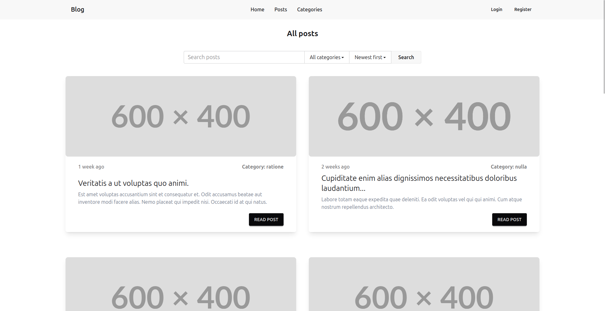
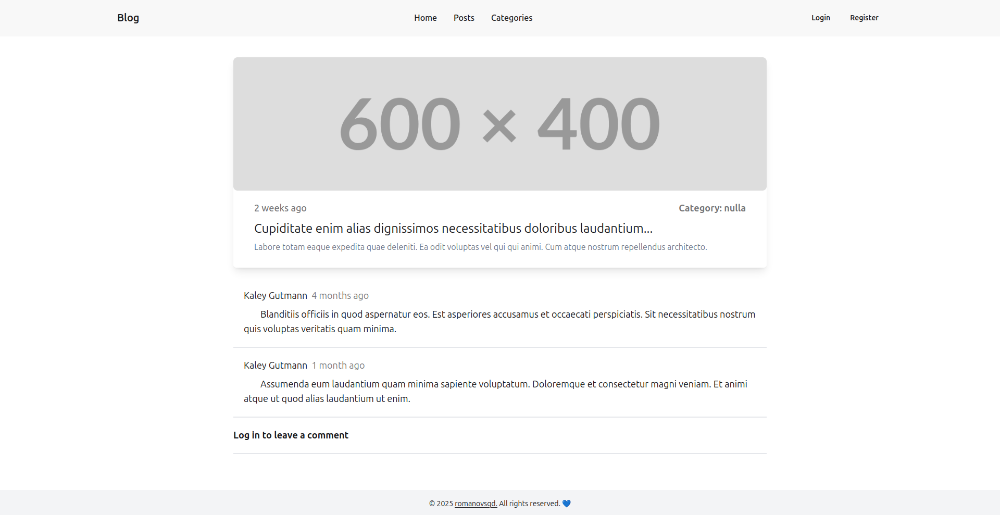

# Блог на Laravel

Мой проект — блог, разработанный на фреймворке Laravel. Этот проект демонстрирует мои навыки веб-разработки, включая работу с backend и frontend, аутентификацией, тестированием и адаптивным дизайном.

## Основной функционал
### Для пользователей
- 📖 Просмотр постов и категорий с человеко-читаемыми URL (slug).
- 💬 Комментирование постов (для зарегистрированных пользователей).
- 📱 Адаптивный интерфейс для мобильных и десктопных устройств.
- 🔍 Поиск постов и категорий по названию и контенту.
- 🏷️ Фильтрация постов по категориям.
- ⏰ Сортировка постов по дате создания.

### Для администраторов
- 🛠️ CRUD-операции для постов и категорий через админ-панель.
- 🔐 Ограниченный доступ только для авторизованных администраторов (реализовано через Laravel Fortify).

### Тестирование
- ✅ Feature-тесты для проверки ключевых сценариев (CRUD, комментирование, доступ).

## Технологии
- **Backend**:
  - Laravel 12
  - PHP 8.4
  - Laravel Fortify (аутентификация)
  - Laravel Sluggable (генерация slug)
- **Frontend**:
  - Blade
  - Tailwind CSS ^4.0
  - daisyUI ^5.0
- **База данных**:
  - MySQL
- **Инструменты**:
  - Laravel Sail (Docker)
  - Composer
  - NPM
  - Git
- **Тестирование**:
  - PHPUnit (Feature-тесты)

## Скриншоты

### 🏠 Список постов


### 📄 Просмотр поста


### ⚙️ Админ-панель


## Установка
### Требования
- PHP
- Git
- Docker
- Composer

### Инструкции
#### 1. Клонирование репозитория
```bash
git clone https://github.com/romanovsqd/blog.git
cd blog
```

#### 2. Настройка окружения
- Скопируйте `.env.example` в `.env`:
  ```bash
  cp .env.example .env
  ```
- Настройте подключение к базе данных в `.env`:
  ```env
  DB_CONNECTION=mysql
  DB_HOST=mysql
  DB_PORT=3306
  DB_DATABASE=laravel
  DB_USERNAME=sail
  DB_PASSWORD=password
  ```


#### 3. Установка зависимостей и запуск sail контейнеров
- Установите composer зависимости:
  ```bash
  composer install
  ```
- Запустите sail контейнеры:
  ```bash
  ./vendor/bin/sail up -d
  ```
- Установите npm зависимости:
  ```bash
  ./vendor/bin/sail npm install
  ```
> Если настроен alias, используйте `sail` вместо `./vendor/bin/sail`.

#### 4. Генерация ключа, запуск миграций, создание симлинка и сборка фронтенда
```bash
./vendor/bin/sail artisan key:generate
./vendor/bin/sail artisan migrate --seed
./vendor/bin/sail artisan storage:link
./vendor/bin/sail npm run dev
```
> После выполнения сидера тестовый администратор доступен с логином `admin@mail.com` и паролем `password`.

#### 5. Запуск
Откройте [http://localhost](http://localhost) в браузере.

## Тестирование
Запустите feature-тесты:
```bash
./vendor/bin/sail test
```

## Лицензия
Проект распространяется под лицензией MIT.

## Контакты
- Telegram: [@sqdcontrast](https://t.me/sqdcontrast)
- Email: [sqdcontrast@gmail.com](mailto:sqdcontrast@gmail.com)
- GitHub: [sqdcontrast](https://github.com/sqdcontrast)

Я открыт к вопросам, предложениям и фидбеку.
